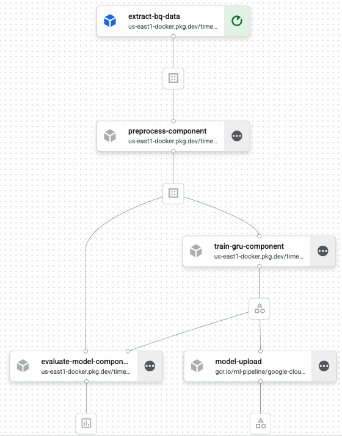

# ML Pipelines for Time Series Forecasting on Vertex AI
## Challenger/Champion ML Workflow with NHITS and GRU Models
This repo includes end to end pipelines for time series forecasting on Vertex AI.  The pipeline trains two models, to compete against eachother on the same dataset.  The first is a traditional RNN using a stacked and regularlized GRU architecture with TensorFlow and Keras.  The second is a  N-HiTS, a state of the art multi-stack MLP, that uses hierarchical interpolation and multi-rate sampling to handle different timescales, deployed with NeuralForecast.  The pipeline is designed to run on Vertex AI using Kubeflow Pipelines (KFP) and leverages GPU acceleration for model training.

<div align="center">
  
</div>

## Overview
The pipeline consists of the following steps:
1. **Extract**: Retrieve time series data from BigQuery 
2. **Preprocess**: Clean the data, remove outliers, engineer features from weather, rolling regime and trigonomic functions cos and sin
3. **Train**: Train both NHITS and GRU models using GPU
4. **Evaluate**: Assess model performance using Mean Absolute Error (MAE) on a test dataset, selecting the best model as the champion
5. **Attach Serving Spec**: Prepare the winning model for deployment with appropriate serving specifications
6. **Deploy**: Deploy the champion model to Vertex AI Model Registry for online predictions


The repo is nearly complete and is expected to finish before the end of DEC 2025.  Feel free to browse all the code and ask any questions.


## File Structure

```
nhits_gcp_workflow/
├── deploy_pipeline.sh                  # Shell script to deploy the Vertex AI pipeline
├── deployment_blockers_summary.md      # Summary of issues blocking deployment
├── deployment_guide.md                 # Documentation guide for the deployment process
├── Dockerfile                          # Default Dockerfile for the project
├── Dockerfile.nhits                    # Dockerfile specifically for the NHITS model environment
├── Dockerfile.serving                  # Dockerfile for the model serving container
├── pipeline.py                         # Definition of the Vertex AI pipeline structure
├── pipelines.png                       # Visual diagram of the pipeline architecture
├── README.md                           # Project overview and instructions
├── requirements.nhits.txt              # Python dependencies for NHITS training
├── requirements.txt                    # General Python dependencies for the project
├── submit_pipeline.py                  # Script to submit the pipeline job to Vertex AI
├── text.sh                             # (Likely a utility or test shell script)
├── weather_data.csv                    # Dataset used for training/testing
├── src/                                # Source code for pipeline components
│   ├── evaluate_models.py              # Component for evaluating trained models
│   ├── extract.py                      # Component for data extraction
│   ├── prediction_utils.py             # Utility functions for making predictions
│   ├── preprocess.py                   # Component for data preprocessing
│   ├── serve.py                        # Code for serving the model (e.g., Flask/FastAPI app)
│   ├── streaming_pipeline.py           # Implementation of a streaming inference pipeline
│   ├── train_gru.py                    # Training script for the GRU model
│   └── train_nhits.py                  # Training script for the NHITS model
└── training_and_preprocessing_workflows/ # Jupyter notebooks for experimentation
    ├── ml_dataset_preprocessing.ipynb  # Notebook for exploring data preprocessing
    ├── model_utils.py                  # Shared utilities for the notebooks
    ├── nhits_training_workflow.ipynb   # Notebook for NHITS model development
    └── tensorflow_lstm_gru_workflow.ipynb # Notebook for LSTM/GRU model development
    ```
