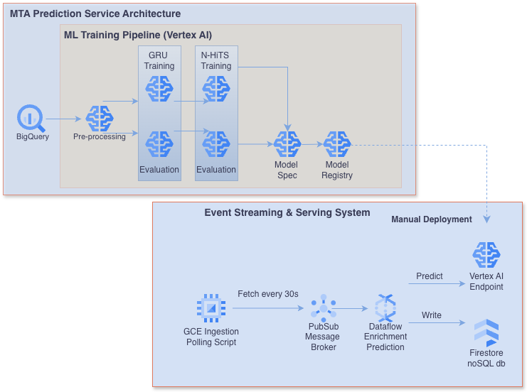

# MTA Prediction Service Deployed on Google Cloud Platform

  

This repository contains the code and configuration to create a prediction service, for passengers traveling on the NYC subway system.  The prediction service will tell passengers how many minutes until their train arrives at their station, to help manage uncertainty with their commute. 
 
There are two systems created within the architecture.  The first is an ML pipeline, designed to train a model that will be deployed to a prediction endpoint.  The second is a streaming data pipeline, designed to take in real-time vehicle position updates from the MTA, and send them to the deployed model for inference. 
 
The data representation is generated at high frequency at irregular intervals.  This presents a challenge for deep learning.  We will train two models with different architectures to gain perspective on good architecture priors.  The first is a traditional RNN, using a stacked and regularized GRU architecture with Tensorflow and Keras, designed to extract meaningful representation from long time sequences.  The second is N-HiTS, which is a state of the art multi-stack MLP, that provides hierarchitical interpolation and multi-rate sampling for time series, .  The N-HiTS model is implemented using the NeuralForecast library and . 