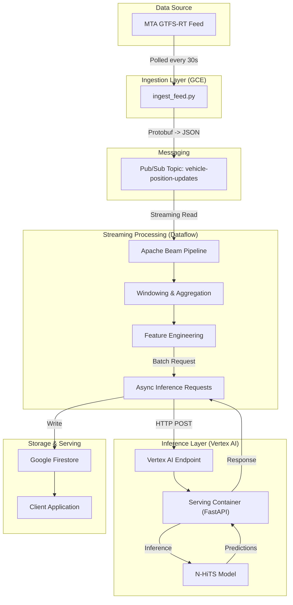

# Architecture Overview: MTA Subway Prediction System

This document outlines the technical architecture of the real-time subway delay prediction system. The system ingests live GTFS-Realtime data from the NYC MTA, processes it via a streaming pipeline, generates predictions using a deep learning model (N-HiTS), and stores the results for consumption.

## High-Level Architecture

---

## Component Details

### 1. Data Ingestion Layer
*   **Component**: `ingestion/ingest_feed.py`
*   **Infrastructure**: Google Compute Engine (GCE) VM (`e2-micro`).
*   **Function**:
    *   Polls the MTA GTFS-Realtime API (L Train Feed) every 30 seconds.
    *   Parses the Protocol Buffer response.
    *   Extracts vehicle positions, timestamps, and stop IDs.
    *   Publishes raw events as JSON messages to Google Cloud Pub/Sub.
*   **Key Resource**: Pub/Sub Topic `vehicle-position-updates`.

### 2. Streaming Processing Layer
*   **Component**: `streaming/pipeline.py`
*   **Infrastructure**: Google Cloud Dataflow (Apache Beam Runner).
*   **Function**:
    *   **Read**: Consumes messages from the Pub/Sub subscription.
    *   **Windowing**: Aggregates data into fixed time windows (e.g., 1-minute windows) to handle out-of-order data and create time-series snapshots.
    *   **Transformation**: Converts raw vehicle positions into model-ready features (time-series vectors).
    *   **Inference Call**: Batches records and sends asynchronous HTTP requests to the Vertex AI Endpoint.
    *   **Sink**: Writes the returned predictions to Firestore.

### 3. Model Serving Layer (Inference)
*   **Component**: `src/serve.py`
*   **Infrastructure**: Vertex AI Prediction Endpoint (Custom Container).
*   **Container**: Docker image based on `python:3.9-slim`, serving via `uvicorn` and `FastAPI`.
*   **Model**: NeuralForecast N-HiTS (Neural Hierarchical Interpolation for Time Series).
*   **Logic**:
    *   Receives a payload containing historical time-series data.
    *   Aligns timestamps to the model's expected frequency.
    *   Runs inference on CPU (or GPU if available).
    *   Returns forecasted delays for future time steps.

### 4. Storage Layer
*   **Component**: Google Firestore (NoSQL Database).
*   **Collection**: `predictions`.
*   **Schema**: Documents are keyed by `route_id` and `timestamp`, containing the predicted delay values.
*   **Usage**: Acts as the backend for any frontend dashboard or alert system.

---

## Data Flow Lifecycle

1.  **T0**: A train moves on the L line. MTA updates their GTFS feed.
2.  **T+1s**: The **Ingestion VM** polls the feed, detects the update, and pushes a message to **Pub/Sub**.
3.  **T+5s**: **Dataflow** reads the message. It waits for the window to close (to gather all updates for that minute).
4.  **T+60s**: The window closes. The pipeline aggregates the data into a time-series format.
5.  **T+61s**: Dataflow sends a request to **Vertex AI**.
6.  **T+62s**: The **N-HiTS model** predicts traffic/delays for the next hour.
7.  **T+63s**: Predictions are written to **Firestore**.
8.  **T+64s**: Users viewing the dashboard see updated predictions.

---

## Technology Stack

| Category | Technology | Usage |
| :--- | :--- | :--- |
| **Language** | Python 3.9+ | All components |
| **Frameworks** | Apache Beam | Streaming Pipeline |
| | FastAPI | Model Serving API |
| | NeuralForecast | Time Series Forecasting Model |
| | PyTorch Lightning | Underlying Model Framework |
| **Cloud Provider** | Google Cloud Platform (GCP) | Hosting |
| **Compute** | GCE, Dataflow, Vertex AI | Execution Environments |
| **Messaging** | Cloud Pub/Sub | Decoupling Ingestion & Processing |
| **Database** | Firestore | Real-time Result Storage |
| **Containerization** | Docker | Reproducible Environments |
